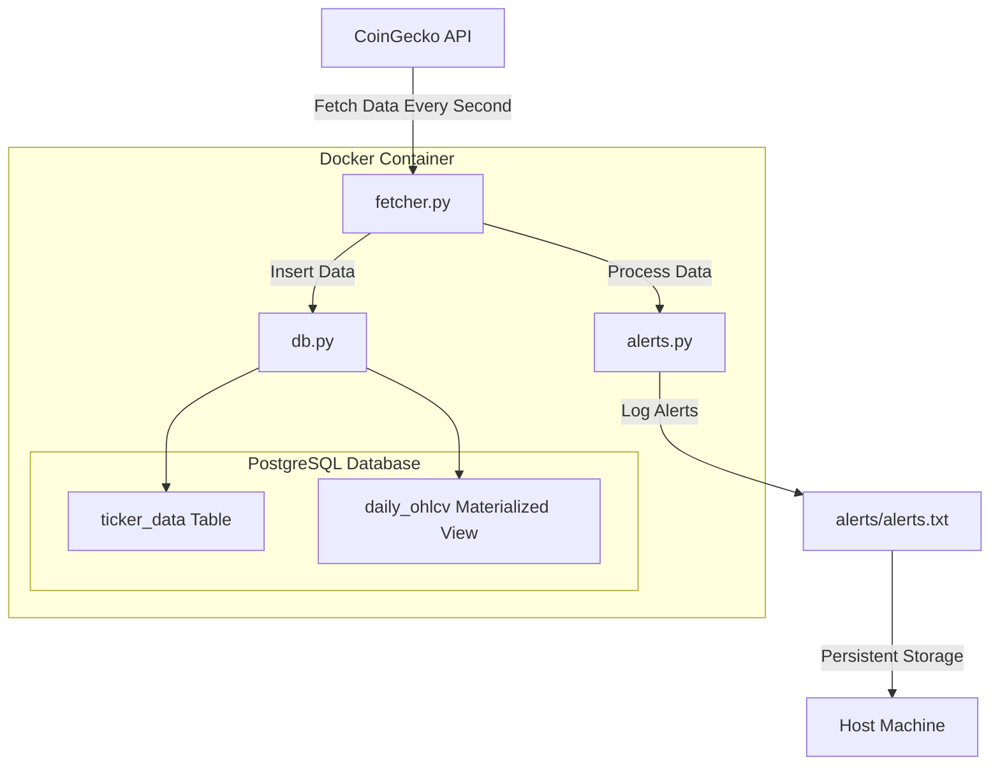

# CryptoMonitor

## Overview

**CryptoMonitor** is a streamlined tool designed within 24 hr, to provide real-time monitoring and alerting for three cryptocurrencies: Bitcoin (BTC), Ethereum (ETH), and Zcash (ZEC). CryptoMonitor fetches data every second, ensuring up-to-date insights. This data is meticulously stored in a PostgreSQL.

**IMPORTANT NOTE:** CoinGecko API offers both free and paid plans. The Demo API plan is accessible to all CoinGecko users at zero cost, with a stable rate limit of 30 calls/min and a monthly cap of 10,000 calls, meaning, even that this solution aims to retreive data per second for three different tickers (BTC, ETH & ZEC), this is NOT possible without upgrading the plan

### Key Features

- **Real-Time Data Ingestion:**
  - **Frequent Updates:** Retrieves the latest price and volume data for BTC, ETH, and ZEC every second from CoinGecko's API.
  - **Resilient Fetching:** Utilizes retry mechanisms to handle transient API failures, ensuring continuous data collection without manual intervention.

- **Data Storage and Management:**
  - **PostgreSQL Integration:** Stores incoming data in a dedicated `ticker_data` table, capturing essential metrics like timestamp, symbol, price in USD, and trading volume.
  - **Historical Analysis:** Maintains a materialized view `daily_ohlcv` that aggregates data into daily Open, High, Low, Close, and Volume (OHLCV) metrics for each cryptocurrency, enabling efficient historical data analysis.

- **Alerting System:**
  - **Threshold-Based Alerts:** Monitors price and volume changes, triggering alerts when deviations exceed 2% from the previous five-minute average.
  - **Persistent Logging:** Logs all triggered alerts to a designated `alerts.txt` file, ensuring alerts are recorded and accessible for review.
  - **Scalable Alerting:** Designed to accommodate additional metrics and cryptocurrencies with minimal adjustments, allowing for flexible expansion based on evolving requirements.

- **Scalability and Performance:**
  - **Optimized Data Handling:** Implements efficient data aggregation and indexing strategies to manage large volumes of incoming data without compromising retrieval speeds.
  - **Dockerized Deployment:** Utilizes Docker and Docker Compose for seamless deployment, ensuring consistency across different environments and simplifying scalability efforts.

- **Monitoring:**
  - **Health Checks:** Incorporates health checks for database connectivity, ensuring the system remains operational and can recover from potential disruptions.
  - **Logging:** Employs structured logging to facilitate easy monitoring and debugging of the application's operations and alerting mechanisms.

### Monitoring & Scalability
- **Alert System:** Implements a push-based approach to monitoring, where alerts are generated and logged in real-time as data is ingested.
- **Scalability Considerations:** Designed to handle increasing volumes of data by optimizing database indexing and utilizing Docker for scalable deployments.

## How to Run CryptoMonitor

### Prerequisites

- **Docker:** Install Docker from [Docker Official Website](https://www.docker.com/get-started).
- **Docker Compose:** Ensure Docker Compose is installed (included with Docker Desktop).

### Steps to Deploy

1. **Clone the Repository**

   Open your terminal, go to the desire location and run:

   ```bash
   git clone https://github.com/Alex-2605/data-challenge.git


2. **Build and Start the Containers**

   Use Docker Compose to build and run the application:

   ```
   docker-compose up -d

- The `-d` flag runs the containers in detached mode..


3. **Verify the Setup**

   Check that both the application and database containers are running:

   ```
   docker-compose ps

- You should see output indicating that both services (`app` and `db`) are up.


4. **Monitor Application Logs**

   If needed you can use logs to view real-time logs and verify data fetching and alerting:

   ```
   docker-compose logs -f app

- Press `Ctrl + C` to exit the log view

5. **Access Alert Logs**

   Alerts are logged in the alerts/alerts.txt file on your host machine. To view the latest alerts:

   ```
   docker-compose up -d

- The `-d` flag runs the containers in detached mode..

6. **Stop the Application**

   When you're done, stop and remove the containers:

   ```
   docker-compose down

### Accessing the PostgreSQL Database

1. **Access the PostgreSQL container**

   Run the following command to access the PostgreSQL database inside the container:

   ```bash
   docker exec -it <db_container_name> psql -U postgres -d crypto_data

### Design & Architecture




CryptoMonitor prioritizes reliability and maintainability. The application is divided into modular components, each handling specific responsibilities:

- **Data Ingestion (`fetcher.py`):** Handles the continuous retrieval of data from CoinGecko's API, ensuring that the database is consistently updated with the latest information.
- **Alert Processing (`alerts.py`):** Evaluates recent data to identify significant changes and logs corresponding alerts.
- **Database Management (`db.py`):** Manages the creation and maintenance of the PostgreSQL database and its tables.
- **View Handling (`views.py`):** Manages the creation and refreshing of the materialized view for historical data analysis.
- **Orchestration (`main.py`):** Serves as the entry point, coordinating the various modules to ensure smooth and efficient operation.

## Tools Used for Each Stage of the Stack

### 1. Sources

- **CoinGecko API**

### 2. Ingestion & Transformation

- **Python-based modules:**

 - **Python `requests` Library**
  - **Purpose:** Facilitates HTTP requests to the CoinGecko API for data retrieval.
  - **Usage:** Implemented in the `fetcher.py` module to fetch data every second.

 - **Python `retry` Library**
  - **Purpose:** Implements retry mechanisms to handle transient API and database failures.
  - **Usage:** Decorates functions in `fetcher.py` and `db.py` to ensure robust data fetching and insertion.

 - **Data Processing in `fetcher.py`**


### 3. Storage

- **PostgreSQL Database**
- **Materialized Views**
- **Python-based modules**
- **Docker**

### 4. Processing

- **Python-based modules:**

 - **`alerts.py` Module**
  - **Purpose:** Monitors price and volume data to trigger alerts when changes exceed a specified threshold, logging these alerts for review.
  - **Functionality:**
    - **Threshold-Based Alerts:** Triggers alerts when price or volume changes exceed a 2% deviation from the previous five-minute average.
    - **Logging:** Writes alert messages to `alerts.txt` for persistent record-keeping.

 - **`views.py` Module**
  - **Purpose:** Creates and manages a materialized view for daily OHLCV data, enabling efficient historical data analysis.
  - **Features:**
    - **Aggregation:** Computes daily OHLCV metrics from raw `ticker_data`.
    - **Periodic Refresh:** Ensures the materialized views are up-to-date by refreshing them at regular intervals (e.g., every 60 seconds).

### 5. Output (Analysis)

- **`alerts.txt` File**
  - **Purpose:** Stores all triggered alerts, providing a historical log of significant market movements.
  - **Location:** Mapped to the host machine via Docker volumes, ensuring persistence beyond container lifecycles.

- **Materialized Views (`daily_ohlcv`)**
  - **Purpose:** Enables efficient querying and analysis of aggregated historical data for each cryptocurrency.
  - **Usage:** Supports trend analysis, reporting, and data-driven decision-making by providing quick access to daily OHLCV metrics.

## Testing and Security Proposals

- **Testing Tools**
  - **Python `unittest` Framework**
    - **Purpose:** Facilitates the creation of unit tests to ensure individual components (functions and modules) behave as expected.
    - **Usage:** Can be implemented to test modules like `alerts.py`, `fetcher.py`, and `db.py` for correctness and reliability.

  - **Mocking Libraries (`unittest.mock`)**
    - **Purpose:** Simulates API responses and database interactions to test the application's resilience and alerting logic without relying on external systems.
    - **Usage:** Used in unit and integration tests to mock CoinGecko API responses and database operations.

- **Security Measures**

  - **Environment Variables**
  - **Database Access Control**
  - **Secure API Communication**
  - **Logging Security**

- **Docker Security**

  - **Trusted Base Images**
  - **Least Privilege Principle**
  - **Regular Updates**

### Future Enhancements

With additional time and resources, CryptoMonitor can be further enhanced to include features such as real-time dashboards, advanced notification systems (e.g., email or SMS alerts), and support for a broader range of cryptocurrencies and metrics.

### Extending CryptoMonitor

 Is easy to extend the capabilities of **CryptoMonitor**, to monitor additional metrics, support more cryptocurrencies, or adapt to different use cases. Here are some ways you can enhance the application:

- **Add More Cryptocurrencies**
- **Monitor Additional Metrics**
- **Customize Alert Conditions**
- **Integrate with Notification Services**
- **Develop a User Interface**
- **Expand to Other Data Sources**

By implementing these extensions, **CryptoMonitor** can evolve into a more powerful and versatile tool, specially for the dynamic world of cryptocurrencies.

## Scalability

As we add more assets, the volume of data grows rapidly, which can slow down our database and make data retrieval less efficient. To handle this without losing any information, we can move our database to a cloud-based solution like **Google BigQuery**. BigQuery is designed to manage large datasets efficiently and can scale seamlessly as our data increases.

To optimize retrieval speed, we can implement indexing on frequently queried fields and use **materialized views** to store pre-aggregated data. Additionally, incorporating caching mechanisms can help reduce the load on the database and speed up data access. Leveraging GCP services not only ensures our application remains fast and responsive but also provides robust tools for monitoring and managing our growing data needs.

---
