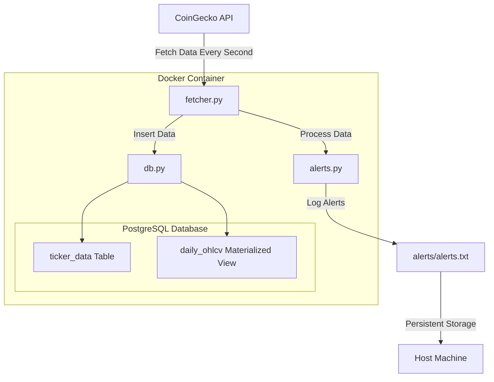

# CryptoMonitor

## 🚀 About the Project

**CryptoMonitor** is a real-time cryptocurrency monitoring system designed in under 24 hours as part of a hiring challenge, where it received strong positive feedback. The tool tracks three major cryptocurrencies **Bitcoin (BTC)**, **Ethereum (ETH)**, and **Zcash (ZEC)** by collecting high-frequency price and volume data, storing it in **PostgreSQL**, and triggering alerts based on dynamic thresholds.

This project has since evolved into a foundational **data engineering portfolio project**, demonstrating modular architecture, Dockerized deployment, real-time ingestion, alerting, and scalable design — with future extensions into GCP and BigQuery for large-scale applications.

> ⚠️ **API Usage Note**: CryptoMonitor uses the [CoinGecko API](https://www.coingecko.com/en/api). The free plan supports **30 calls/minute**, which is **not sufficient for 1-second polling for 3 tickers**. For unrestricted usage, upgrade the API plan or lower the polling frequency.

---

## 🧠 Key Features

- **Real-Time Ingestion**  
  Polls CoinGecko API at high frequency to fetch price/volume data for BTC, ETH, ZEC.

- **Modular Architecture**  
  Separated logic for data fetching, alerting, DB operations, and view generation for clarity and maintainability.

- **Threshold-Based Alerts**  
  Triggers alerts when price/volume deviate by >2% from the 5-minute moving average.

- **Efficient Storage**  
  Stores raw data in `ticker_data` table and aggregates into `daily_ohlcv` materialized views.

- **Dockerized Deployment**  
  Simplified containerized setup via `docker-compose`.

- **Scalable Design**  
  Easily extendable to more assets, metrics, or backends (e.g., BigQuery).

---

## 🧩 Architecture Overview


```mermaid
graph TD
    A[CoinGecko API] -->|Fetch Data Every Second| B[fetcher.py]
    B -->|Process Data| C[alerts.py]
    B -->|Insert Data| D[db.py]
    
    subgraph Docker Container
        subgraph PostgreSQL Database
            E[ticker_data Table]
            F[daily_ohlcv Materialized View]
        end
        B
        C
        D --> E
        D --> F
    end

    C -->|Log Alerts| G[alerts/alerts.txt]
    G -->|Persistent Storage| H[Host Machine]
```

---

## 🗂️ Project Structure

- `fetcher.py`: Connects to the CoinGecko API and fetches live cryptocurrency data.
- `db.py`: Handles database setup, connections, and inserts.
- `alerts.py`: Analyzes recent price/volume data to generate alerts.
- `views.py`: Manages materialized views for OHLCV aggregation.
- `main.py`: Central orchestration script that runs all modules together.

---

## ⚙️ How to Run

### Prerequisites

- Docker & Docker Compose installed

### Deployment

```bash
# Clone the repo
git clone https://github.com/Alex-2605/data-challenge.git
cd data-challenge

# Start the services
docker-compose up -d

# View logs (optional)
docker-compose logs -f app

# Stop the services
docker-compose down
```

### Alert Logs

Alerts are stored in:

```bash
alerts/alerts.txt
```

### Accessing PostgreSQL

```bash
docker exec -it <db_container_name> psql -U postgres -d crypto_data
```

---

## 📈 Scalability and Future Enhancements

- **Cloud Migration**: Use BigQuery for large-scale storage and querying.
- **Indexing & Views**: Optimize queries with database indexes and materialized views.
- **Dashboards**: Build visual dashboards using Streamlit or Looker Studio.
- **Notification System**: Integrate email/SMS/webhooks for real-time alerts.
- **Orchestration**: Move to Airflow or Cloud Composer for scheduled ETL.
- **Testing Pipeline**: Add unit/integration tests with CI/CD.

---

## 🧪 Testing & Security Practices

### Testing

- Use `unittest` for core module testing.
- Mock external API/database calls with `unittest.mock`.

### Security

- Use environment variables for credentials.
- Ensure API communication over HTTPS.
- Restrict DB access and use minimal Docker images.

---

## 🌐 Potential Extensions

- Support more cryptocurrencies or trading pairs.
- Monitor additional metrics (market cap, RSI, etc.).
- Set custom alert logic per coin or market condition.
- Replace PostgreSQL with BigQuery or another cloud-native DWH.
- Add interactive UI to manage configurations and view results.

---

## 📌 Final Thoughts

CryptoMonitor demonstrates the foundation of a real-time, modular, and scalable data monitoring pipeline. With production-ready architecture and flexibility, it’s an ideal base to grow into a complete analytics platform for cryptocurrencies and other streaming data domains.
